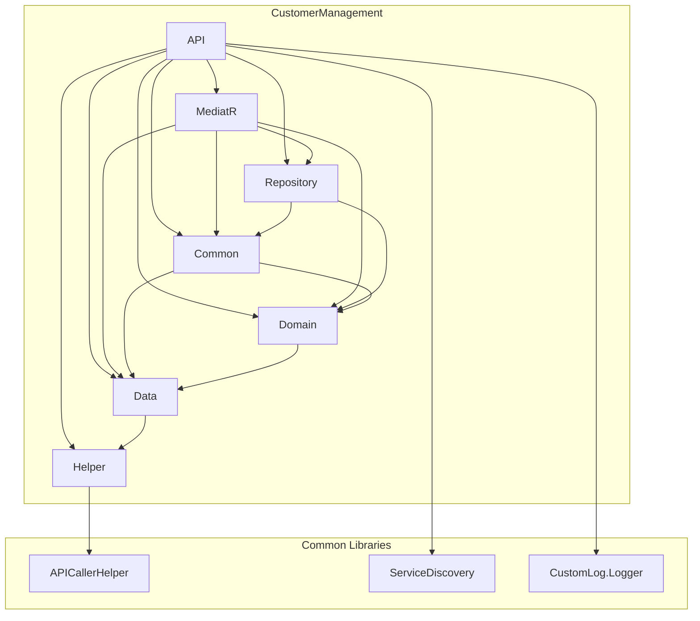

# Audit Architectural de la Solution `SampleFluxProject`

## Partie I : Cartographie de la Solution et Standards Technologiques

### 1. Inventaire des Composants

Basé sur l'analyse du fichier `CBSManagementService.sln`, la solution est composée des projets suivants, organisés en trois catégories principales :

#### A. ApiGateway

*   **CBS.Gateway.API** : Le projet principal de la passerelle API, utilisant Ocelot.
*   **CBS.Gateway.DataContext** : Le contexte de données pour la passerelle, probablement pour la journalisation ou la gestion d'état.

#### B. Librairies Communes (`Common/*`)

*   **CBS.APICaller.Helper** : Une librairie centrale pour effectuer des appels HTTP entre les microservices.
*   **CBS.CustomLog.Logger** : Un wrapper de logging personnalisé, probablement autour de NLog ou Serilog.
*   **CBS.ServicesDelivery.Service** : Une librairie pour la découverte de services, probablement avec Consul.

#### C. Microservices Métier (`CoreServices/*`)

La solution contient un nombre significatif de microservices, chacun suivant une architecture en couches similaire.

*   **AccountManagement**:
    -   `CBS.AccountManagement.API`
    -   `CBS.AccountManagement.Common`
    -   `CBS.AccountManagement.Data`
    -   `CBS.AccountManagement.Domain`
    -   `CBS.AccountManagement.Helper`
    -   `CBS.AccountManagement.MediatR`
    -   `CBS.AccountManagement.Repository`
*   **BankManagement**:
    -   `CBS.BankMGT.API`
    -   `CBS.BankMGT.Common`
    -   `CBS.BankMGT.Data`
    -   `CBS.BankMGT.Domain`
    -   `CBS.BankMGT.Helper`
    -   `CBS.BankMGT.MediatR`
    -   `CBS.BankMGT.Repository`
*   **BudgetManagement**:
    -   `CBS.BudgetManagement.API`
    -   `CBS.BudgetManagement.Common`
    -   `CBS.BudgetManagement.Data`
    -   `CBS.BudgetManagement.Domain`
    -   `CBS.BudgetManagement.Helper`
    -   `CBS.BudgetManagement.MediatR`
    -   `CBS.BudgetManagement.Repository`
*   **CheckManagement**:
    -   `CBS.CheckManagement.API`
    -   `CBS.CheckManagement.Common`
    -   `CBS.CheckManagement.Data`
    -   `CBS.CheckManagement.Domain`
    -   `CBS.CheckManagement.Helper`
    -   `CBS.CheckManagement.MediatR`
    -   `CBS.CheckManagement.Repository`
*   **CommunicationManagement**:
    -   `CBS.Communication.API`
    -   `CBS.Communication.Common`
    -   `CBS.Communication.Data`
    -   `CBS.Communication.Domain`
    -   `CBS.Communication.Helper`
    -   `CBS.Communication.MediatR`
    -   `CBS.Communication.Repository`
*   **CustomerManagement**:
    -   `CBS.CUSTOMER.API`
    -   `CBS.CUSTOMER.COMMON`
    -   `CBS.CUSTOMER.DATA`
    -   `CBS.CUSTOMER.DOMAIN`
    -   `CBS.CUSTOMER.HELPER`
    -   `CBS.CUSTOMER.MEDIATR`
    -   `CBS.CUSTOMER.REPOSITORY`
*   **FixedAssetsManagement**:
    -   `CBS.FixedAssetsManagement.API`
    -   `CBS.FixedAssetsManagement.Common`
    -   `CBS.FixedAssetsManagement.Data`
    -   `CBS.FixedAssetsManagement.Domain`
    -   `CBS.FixedAssetsManagement.Helper`
    -   `CBS.FixedAssetsManagement.MediatR`
    -   `CBS.FixedAssetsManagement.Repository`
*   **LoanManagement**:
    -   `CBS.Loan.API`
    -   `CBS.Loan.Common`
    -   `CBS.Loan.Data`
    -   `CBS.Loan.Domain`
    -   `CBS.Loan.Helper`
    -   `CBS.Loan.MediatR`
    -   `CBS.Loan.Repository`
*   **MODELE** (semble être un template de microservice):
    -   `CBS.MODELE.API`
    -   `CBS.MODELE.Common`
    -   `CBS.MODELE.Data`
    -   `CBS.MODELE.Domain`
    -   `CBS.MODELE.Helper`
    -   `CBS.MODELE.MediatR`
    -   `CBS.MODELE.Repository`
*   **SystemConfiguration**:
    -   `CBS.SystemConfiguration.API`
    -   `CBS.SystemConfiguration.Common`
    -   `CBS.SystemConfiguration.Data`
    -   `CBS.SystemConfiguration.Domain`
    -   `CBS.SystemConfiguration.Helper`
    -   `CBS.SystemConfiguration.MediatR`
    -   `CBS.SystemConfiguration.Repository`
*   **UserServiceManagement**:
    -   `CBS.UserServiceManagement.API`
    -   `CBS.UserServiceManagement.Common`
    -   `CBS.UserServiceManagement.Data`
    -   `CBS.UserServiceManagement.Domain`
    -   `CBS.UserServiceManagement.Helper`
    -   `CBS.UserServiceManagement.MediatR`
    -   `CBS.UserServiceManagement.Repository`
*   **UserServiceMGT** (semble être une copie de `UserServiceManagement`):
    -   `CBS.UserServiceMGT.API`
    -   `CBS.UserServiceMGT.Common`
    -   `CBS.UserServiceMGT.Data`
    -   `CBS.UserServiceMGT.Domain`
    -   `CBS.UserServiceMGT.Helper`
    -   `CBS.UserServiceMGT.MediatR`
    -   `CBS.UserServiceMGT.Repository`
*   **UserSkillManagement**:
    -   `CBS.UserSkillManagement.API`
    -   `CBS.UserSkillManagement.Common`
    -   `CBS.UserSkillManagement.Data`
    -   `CBS.UserSkillManagement.Domain`
    -   `CBS.UserSkillManagement.Helper`
    -   `CBS.UserSkillManagement.MediatR`
    -   `CBS.UserSkillManagement.Repository`

### 2. Analyse des Dépendances et Standards

#### Anomalies et Hétérogénéité

Une analyse des fichiers `.csproj` révèle des informations cruciales sur les standards technologiques et leur application à travers l'écosystème.

*   **Fichiers de Projet Manquants :**
    *   **Preuve :** Le fichier projet `CoreServices/AccountManagement/CBS.AccountManagement.Domain/CBS.AccountManagement.Domain.csproj` est référencé dans `CBSManagementService.sln` mais est **absent** du dépôt.
    *   **Impact :** La solution est actuellement **incompilable** en l'état.

*   **Service Manquant :**
    *   **Preuve :** Le service `cbs_transaction` est défini dans `docker-compose.yml` mais son code source est **absent** du dossier `CoreServices`.
    *   **Impact :** L'audit des flux de communication impliquant ce service est impossible.

*   **Hétérogénéité des Dépendances Critiques :**
    1.  **Microsoft.EntityFrameworkCore**:
        -   `AccountManagement` utilise la version **`7.0.13`**.
        -   `CustomerManagement` utilise la version **`7.0.14`**.
        -   **Conclusion**: Il n'y a pas de standardisation de la version du package EF Core.
    2.  **MediatR**:
        -   `AccountManagement.API` utilise la version **`12.4.1`**.
        -   `AccountManagement.MediatR` utilise la version **`12.1.1`**.
        -   `CustomerManagement` standardise sur la version **`12.1.1`**.
        -   **Conclusion**: Il existe une incohérence de version de MediatR au sein même d'un microservice.

#### Diagramme des Couches - `CustomerManagement`



**Analyse de la Structure en Couches :**

*   **Anomalie Architecturale :** Le projet `Domain` a une dépendance directe sur le projet `Data`. Normalement, la couche `Domain` est au centre et ne doit dépendre d'aucune autre couche. Cette inversion est une anomalie architecturale notable.

## Partie II : Dissection de l'Anatomie d'un Microservice Standard ("CustomerManagement")

### 1. Le Rôle des 7 Couches (Prouvé par le Code)

| Couche | Rôle Principal | Preuve par Fichier |
|---|---|---|
| **API** | Point d'entrée du service, expose les endpoints HTTP. | `CoreServices/CustomerManagement/CBS.CUSTOMER.API/Controllers/Customer/CustomerController.cs` |
| **MediatR** | Implémente le pattern CQRS avec MediatR. Contient les `Commands`, `Queries`, et leurs `Handlers`. | `CoreServices/CustomerManagement/CBS.CUSTOMER.MEDIATR/Customer/Command/AddCustomerCommand.cs` |
| **Repository**| Couche d'abstraction au-dessus de l'accès aux données. | `CoreServices/CustomerManagement/CBS.CUSTOMER.REPOSITORY/CustomerRepo/CustomerRepository.cs` |
| **Domain** | Contient le `DbContext` Entity Framework et devrait contenir la logique métier. | `CoreServices/CustomerManagement/CBS.CUSTOMER.DOMAIN/Context/POSContext.cs` |
| **Data** | Contient les `DTOs` et les `Entités` ORM. | `CoreServices/CustomerManagement/CBS.CUSTOMER.DATA/Entity/Customers/Customer.cs` |
| **Common** | Fournit des classes utilitaires partagées au sein du microservice (`UnitOfWork`, `GenericRepository`). | `CoreServices/CustomerManagement/CBS.CUSTOMER.COMMON/UnitOfWork/UnitOfWork.cs` |
| **Helper** | Contient des classes d'aide de bas niveau (sécurité, communication). | `CoreServices/CustomerManagement/CBS.CUSTOMER.HELPER/Helper/PinSecurity.cs` |

### 2. Le Standard de Configuration (`Startup.cs`)

L'analyse du `Startup.cs` de `CustomerManagement` montre un pipeline de middlewares ASP.NET Core structuré logiquement, avec la gestion des erreurs au début, suivie de la configuration de la requête, de l'authentification/autorisation, et enfin de l'exécution des endpoints.

### 3. Les Patterns de Code Fondamentaux

*   **`ServiceResponse<T>`:** Un objet de réponse standardisé est utilisé pour toutes les réponses d'API, avec des méthodes factory pour la cohérence.
    *   **Preuve :** `CoreServices/CustomerManagement/CBS.CUSTOMER.HELPER/Helper/ServiceResponse.cs`
*   **`GenericRepository` et `UnitOfWork`:** L'accès aux données est abstrait et les transactions sont gérées de manière atomique, avec une logique d'audit centralisée.
    *   **Preuve :** `CoreServices/CustomerManagement/CBS.CUSTOMER.COMMON/UnitOfWork/UnitOfWork.cs`
*   **`ValidationBehavior` de MediatR:** Un pipeline behavior intercepte les requêtes MediatR pour les valider avec FluentValidation avant l'exécution du handler.
    *   **Preuve :** `CoreServices/CustomerManagement/CBS.CUSTOMER.MEDIATR/PipeLineBehavior/ValidationBehavior.cs`

## Partie III : Analyse Récursive des Interactions et Dépendances Croisées

### 1. Le Mécanisme de Communication

Le système utilise un pattern "Façade + Helper Centralisé" pour la communication inter-services. Un `Handler` MediatR appelle une façade dans la couche `Helper` du service local, qui à son tour utilise le `CBS.APICaller.Helper` centralisé pour effectuer l'appel `HttpClient`.

### 2. Cartographie des Appels Inter-Services

| Service Appelant | Service Appelé (Déduit) |
|---|---|
| `AccountManagement` | `IdentityService`, `BankManagement`, `TransactionManagement` |
| `LoanManagement` | `CustomerManagement`, `TransactionManagement`, `AccountManagement`, `CommunicationManagement`, `BankManagement`, `IdentityService` |
| `BankManagement` | `IdentityService` |
| `CommunicationManagement`| `IdentityService` |

**Diagramme des Interactions :**

```mermaid
graph LR
    subgraph Services
        LM[LoanManagement]
        AM[AccountManagement]
        BM[BankManagement]
        CM[CustomerManagement]
        COM[CommunicationManagement]
        IM[IdentityService (non présent)]
        TM[TransactionManagement (non présent)]
    end

    LM --> CM; LM --> TM; LM --> AM; LM --> COM; LM --> BM; LM --> IM;
    AM --> IM; AM --> BM; AM --> TM;
    BM --> IM; COM --> IM;
```

**Analyse :** `LoanManagement` est un "hub" central, ce qui en fait un composant critique. L'architecture est fortement couplée.

### 3. Gestion des Contrats de Données (DTOs)

La stratégie est basée sur la **duplication manuelle de DTOs**, ce qui est une source majeure de dette technique.

*   **Preuve :** Le DTO `CustomerDto` utilisé par `LoanManagement` (`CoreServices/LoanManagement/CBS.Loan.Data/Dto/CustomerP/CustomerDto.cs`) est une copie périmée et incomplète du DTO original défini dans `CustomerManagement` (`CoreServices/CustomerManagement/CBS.CUSTOMER.DATA/Dto/Customers/CustomerDto.cs`).

## Partie IV : Analyse de la Chaîne de Sécurité et de la Découverte de Services

### 1. La Découverte via Consul

*   **Mécanisme :** La librairie `Common/ServiceDiscovery` permet l'enregistrement des services auprès de Consul.
*   **Configuration :** Ocelot est configuré dans `ApiGateway/Public/ocelot.Development.json` pour utiliser Consul.
*   **Anomalie :** L'utilisation est incohérente; `CustomerManagement` et `BankManagement` ont les appels à `UseConsul` commentés.

### 2. La Chaîne de Validation JWT

*   **Mécanisme :** La validation est gérée par le middleware standard `JwtBearer` d'ASP.NET Core dans l'ApiGateway. Le `ApiCallerHelper` propage le token aux services en aval.
*   **Anomalie de Sécurité Majeure :** Le pipeline Ocelot dans le `Startup.cs` de l'ApiGateway est configuré pour **contourner complètement le middleware d'autorisation d'Ocelot**.
    *   **Preuve :**
        ```csharp
        var configuration = new OcelotPipelineConfiguration
        {
            AuthorizationMiddleware = async (context, next) => { await next.Invoke(); }
        };
        app.UseOcelot(configuration);
        ```
    *   **Impact :** La sécurité d'autorisation (par exemple, basée sur les rôles) au niveau de la passerelle est désactivée. La sécurité repose entièrement sur les attributs `[Authorize]` dans chaque microservice individuel.
