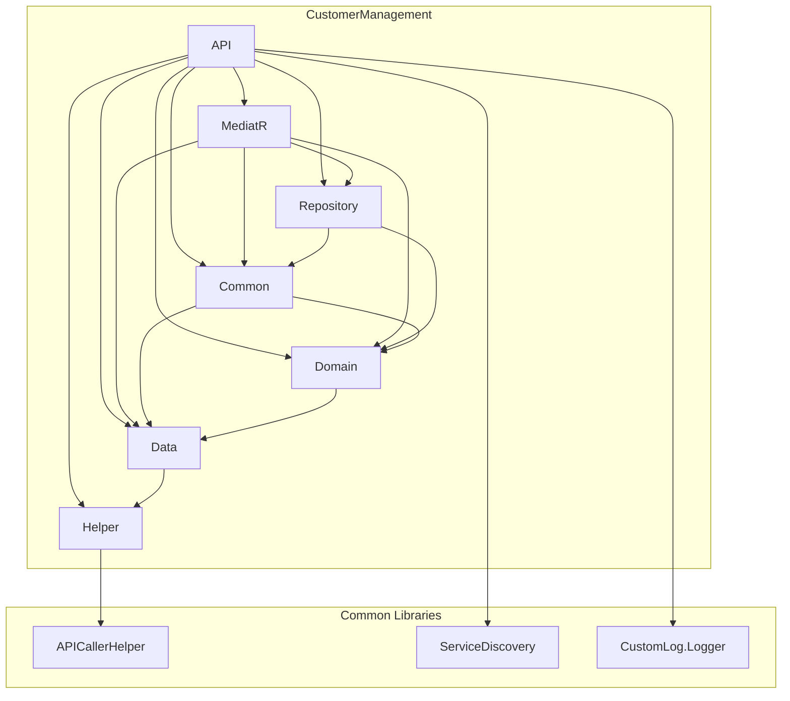

# Audit Architectural de la Solution `SampleFluxProject`

## Partie I : Cartographie de la Solution et Standards Technologiques

### 1. Inventaire des Composants

Basé sur l'analyse du fichier `CBSManagementService.sln`, la solution est composée des projets suivants, organisés en trois catégories principales :

#### A. ApiGateway

*   **CBS.Gateway.API** : Le projet principal de la passerelle API, utilisant Ocelot.
*   **CBS.Gateway.DataContext** : Le contexte de données pour la passerelle, probablement pour la journalisation ou la gestion d'état.

#### B. Librairies Communes (`Common/*`)

*   **CBS.APICaller.Helper** : Une librairie centrale pour effectuer des appels HTTP entre les microservices.
*   **CBS.CustomLog.Logger** : Un wrapper de logging personnalisé, probablement autour de NLog ou Serilog.
*   **CBS.ServicesDelivery.Service** : Une librairie pour la découverte de services, probablement avec Consul.

#### C. Microservices Métier (`CoreServices/*`)

La solution contient un nombre significatif de microservices, chacun suivant une architecture en couches similaire.

*   **AccountManagement**:
    -   `CBS.AccountManagement.API`
    -   `CBS.AccountManagement.Common`
    -   `CBS.AccountManagement.Data`
    -   `CBS.AccountManagement.Domain`
    -   `CBS.AccountManagement.Helper`
    -   `CBS.AccountManagement.MediatR`
    -   `CBS.AccountManagement.Repository`
*   **BankManagement**:
    -   `CBS.BankMGT.API`
    -   `CBS.BankMGT.Common`
    -   `CBS.BankMGT.Data`
    -   `CBS.BankMGT.Domain`
    -   `CBS.BankMGT.Helper`
    -   `CBS.BankMGT.MediatR`
    -   `CBS.BankMGT.Repository`
*   **BudgetManagement**:
    -   `CBS.BudgetManagement.API`
    -   `CBS.BudgetManagement.Common`
    -   `CBS.BudgetManagement.Data`
    -   `CBS.BudgetManagement.Domain`
    -   `CBS.BudgetManagement.Helper`
    -   `CBS.BudgetManagement.MediatR`
    -   `CBS.BudgetManagement.Repository`
*   **CheckManagement**:
    -   `CBS.CheckManagement.API`
    -   `CBS.CheckManagement.Common`
    -   `CBS.CheckManagement.Data`
    -   `CBS.CheckManagement.Domain`
    -   `CBS.CheckManagement.Helper`
    -   `CBS.CheckManagement.MediatR`
    -   `CBS.CheckManagement.Repository`
*   **CommunicationManagement**:
    -   `CBS.Communication.API`
    -   `CBS.Communication.Common`
    -   `CBS.Communication.Data`
    -   `CBS.Communication.Domain`
    -   `CBS.Communication.Helper`
    -   `CBS.Communication.MediatR`
    -   `CBS.Communication.Repository`
*   **FixedAssetsManagement**:
    -   `CBS.FixedAssetsManagement.API`
    -   `CBS.FixedAssetsManagement.Common`
    -   `CBS.FixedAssetsManagement.Data`
    -   `CBS.FixedAssetsManagement.Domain`
    -   `CBS.FixedAssetsManagement.Helper`
    -   `CBS.FixedAssetsManagement.MediatR`
    -   `CBS.FixedAssetsManagement.Repository`
*   **MODELE** (semble être un template de microservice):
    -   `CBS.MODELE.API`
    -   `CBS.MODELE.Common`
    -   `CBS.MODELE.Data`
    -   `CBS.MODELE.Domain`
    -   `CBS.MODELE.Helper`
    -   `CBS.MODELE.MediatR`
    -   `CBS.MODELE.Repository`
*   **SystemConfiguration**:
    -   `CBS.SystemConfiguration.API`
    -   `CBS.SystemConfiguration.Common`
    -   `CBS.SystemConfiguration.Data`
    -   `CBS.SystemConfiguration.Domain`
    -   `CBS.SystemConfiguration.Helper`
    -   `CBS.SystemConfiguration.MediatR`
    -   `CBS.SystemConfiguration.Repository`
*   **UserServiceManagement**:
    -   `CBS.UserServiceManagement.API`
    -   `CBS.UserServiceManagement.Common`
    -   `CBS.UserServiceManagement.Data`
    -   `CBS.UserServiceManagement.Domain`
    -   `CBS.UserServiceManagement.Helper`
    -   `CBS.UserServiceManagement.MediatR`
    -   `CBS.UserServiceManagement.Repository`
*   **UserServiceMGT** (semble être une copie de `UserServiceManagement`):
    -   `CBS.UserServiceMGT.API`
    -   `CBS.UserServiceMGT.Common`
    -   `CBS.UserServiceMGT.Data`
    -   `CBS.UserServiceMGT.Domain`
    -   `CBS.UserServiceMGT.Helper`
    -   `CBS.UserServiceMGT.MediatR`
    -   `CBS.UserServiceMGT.Repository`
*   **UserSkillManagement**:
    -   `CBS.UserSkillManagement.API`
    -   `CBS.UserSkillManagement.Common`
    -   `CBS.UserSkillManagement.Data`
    -   `CBS.UserSkillManagement.Domain`
    -   `CBS.UserSkillManagement.Helper`
    -   `CBS.UserSkillManagement.MediatR`
    -   `CBS.UserSkillManagement.Repository`

### 2. Analyse des Dépendances et Standards

#### Hétérogénéité et Dépendances Critiques

Une analyse des fichiers `.csproj` révèle des informations cruciales sur les standards technologiques et leur application à travers l'écosystème.

**Fichier de projet manquant :**
- **Preuve :** Le fichier projet `CoreServices/AccountManagement/CBS.AccountManagement.Domain/CBS.AccountManagement.Domain.csproj` est référencé dans `CBSManagementService.sln` mais est **absent** du dépôt.
- **Impact :** La solution est actuellement **incompilable** en l'état. C'est une anomalie majeure qui doit être corrigée.

#### Matrice de Dépendances - `AccountManagement`

| Projet | TargetFramework | Dépendance NuGet | Version |
|---|---|---|---|
| **CBS.AccountManagement.API** | `net8.0` | ExcelDataReader.DataSet | `3.6.0` |
| | | FluentValidation.DependencyInjectionExtensions | `11.10.0` |
| | | Hangfire.AspNetCore | `1.8.12` |
| | | Hangfire.SqlServer | `1.8.12` |
| | | MediatR | `12.4.1` |
| | | Microsoft.AspNetCore.Mvc.NewtonsoftJson | `7.0.14` |
| | | Microsoft.AspNetCore.OpenApi | `7.0.12` |
| | | Microsoft.EntityFrameworkCore | `7.0.13` |
| | | Microsoft.EntityFrameworkCore.Design | `7.0.13` |
| | | Microsoft.IdentityModel.Tokens | `7.7.0` & `8.5.0` |
| | | NLog.Web.AspNetCore | `5.3.5` |
| | | Serilog.AspNetCore | `7.0.0` |
| | | Swashbuckle.AspNetCore | `6.5.0` |
| | | System.Data.SqlClient | `4.8.6` |
| **CBS.AccountManagement.Common** | `net8.0` | Microsoft.EntityFrameworkCore | `7.0.13` |
| | | MongoDB.Driver | `3.0.0` |
| | | MongoDB.Driver.Core | `2.30.0` |
| **CBS.AccountManagement.Data** | `net8.0` | EPPlus | `7.0.5` |
| | | Microsoft.Web.Administration | `11.1.0` |
| | | Newtonsoft.Json | `13.0.3` |
| **CBS.AccountManagement.Domain** | `N/A` | **Fichier .csproj manquant** | `N/A` |
| **CBS.AccountManagement.Helper** | `net8.0` | (Aucune dépendance NuGet directe) | |
| **CBS.AccountManagement.MediatR**| `net8.0` | AutoMapper | `12.0.1` |
| | | ClosedXML | `0.104.2` |
| | | ExcelDataReader.DataSet | `3.6.0` |
| | | FluentValidation | `11.8.0` |
| | | MediatR | `12.1.1` |
| | | Polly | `8.4.0` |
| **CBS.AccountManagement.Repository**| `net8.0` | (Aucune dépendance NuGet directe) | |

#### Matrice de Dépendances - `CustomerManagement`

| Projet | TargetFramework | Dépendance NuGet | Version |
|---|---|---|---|
| **CBS.CUSTOMER.API** | `net8.0` | FluentValidation.AspNetCore | `11.3.0` |
| | | Microsoft.AspNetCore.Mvc.NewtonsoftJson| `7.0.14` |
| | | Microsoft.EntityFrameworkCore | `7.0.14` |
| | | NLog.Web.AspNetCore | `5.3.5` |
| | | Serilog.Extensions.Hosting | `8.0.0` |
| | | Swashbuckle.AspNetCore | `6.5.0` |
| **CBS.CUSTOMER.COMMON** | `net8.0` | Microsoft.EntityFrameworkCore | `7.0.14` |
| | | Newtonsoft.Json | `13.0.3` |
| **CBS.CUSTOMER.DATA** | `net8.0` | Microsoft.EntityFrameworkCore | `7.0.14` |
| | | Microsoft.Web.Administration | `11.1.0` |
| | | Newtonsoft.Json | `13.0.3` |
| **CBS.CUSTOMER.DOMAIN** | `net8.0` | Microsoft.EntityFrameworkCore | `7.0.14` |
| | | Microsoft.EntityFrameworkCore.Relational| `7.0.14` |
| | | Microsoft.EntityFrameworkCore.SqlServer| `7.0.14` |
| | | Microsoft.EntityFrameworkCore.Tools | `7.0.14` |
| | | MongoDB.Driver | `3.1.0` |
| **CBS.CUSTOMER.HELPER** | `net8.0` | MongoDB.Driver | `3.1.0` |
| | | Newtonsoft.Json | `13.0.3` |
| | | SixLabors.ImageSharp | `3.1.1` |
| **CBS.CUSTOMER.MEDIATR**| `net8.0` | AutoMapper | `12.0.1` |
| | | BCrypt.Net-Next | `4.0.3` |
| | | EPPlus | `7.1.2` |
| | | FluentValidation | `11.8.0` |
| | | MediatR | `12.1.1` |
| **CBS.CUSTOMER.REPOSITORY**| `net8.0` | FluentValidation | `11.8.0` |
| | | MediatR | `12.1.1` |
| | | System.Linq.Dynamic.Core | `1.3.14` |

#### Faits Saillants sur l'Hétérogénéité

1.  **Microsoft.EntityFrameworkCore**:
    -   `AccountManagement` utilise la version **`7.0.13`**.
    -   `CustomerManagement` utilise la version **`7.0.14`**.
    -   **Conclusion**: Il n'y a pas de standardisation de la version du package EF Core, ce qui peut entraîner des comportements inattendus et des difficultés de maintenance.

2.  **MediatR**:
    -   `AccountManagement.API` utilise la version **`12.4.1`**.
    -   `AccountManagement.MediatR` utilise la version **`12.1.1`**.
    -   `CustomerManagement` standardise sur la version **`12.1.1`**.
    -   **Conclusion**: Il existe une incohérence de version de MediatR au sein même du microservice `AccountManagement`, ce qui est une pratique à haut risque.

#### Diagramme des Couches - `CustomerManagement`

Le diagramme suivant illustre les dépendances entre les projets au sein du microservice `CustomerManagement`. Il met en évidence la structure en couches de l'application.



**Analyse de la Structure en Couches :**

- **Couche de Présentation (`API`) :** Le projet `API` est le point d'entrée. Il dépend de presque toutes les autres couches, ce qui est typique pour l'injection de dépendances, mais une dépendance directe sur `Data` ou `Domain` pourrait indiquer un couplage fort.
- **Dépendance Inversée Inhabituelle :** Le projet `Domain` a une dépendance directe sur le projet `Data` (`<ProjectReference Include="..\CBS.CUSTOMER.DATA\CBS.CUSTOMER.DATA.csproj" />`). Dans une architecture en couches classique (comme l'Architecture Oignon ou Clean Architecture), la couche `Domain` est au centre et ne doit dépendre d'aucune autre couche (surtout pas de `Data`). `Data` devrait dépendre de `Domain`. Cette inversion est une **anomalie architecturale notable**.
- **Couche `Common` :** Ce projet semble contenir une logique partagée, mais sa dépendance à la fois sur `Domain` et `Data` le rend difficile à positionner clairement dans la hiérarchie des couches.

## Partie II : Dissection de l'Anatomie d'un Microservice Standard ("CustomerManagement")

En utilisant `CustomerManagement` comme étalon, nous pouvons déduire l'architecture cible pour tous les microservices de la solution.

### 1. Le Rôle des 7 Couches (Prouvé par le Code)

Chaque microservice est décomposé en 7 projets distincts, chacun ayant un rôle spécifique.

| Couche | Rôle Principal | Preuve par Fichier |
|---|---|---|
| **API** | Point d'entrée du service, expose les endpoints HTTP. Configure le pipeline ASP.NET Core, l'injection de dépendances et les middlewares. | `CoreServices/CustomerManagement/CBS.CUSTOMER.API/Controllers/Customer/CustomerController.cs` |
| **MediatR** | Implémente le pattern CQRS avec MediatR. Contient les `Commands`, `Queries`, et leurs `Handlers`. Orchestre la logique applicative en faisant appel aux repositories et autres services. | `CoreServices/CustomerManagement/CBS.CUSTOMER.MEDIATR/Customer/Command/AddCustomerCommand.cs` |
| **Repository**| Couche d'abstraction au-dessus de l'accès aux données. Définit les interfaces (`IRepository`) et leurs implémentations (`Repository`) pour les opérations CRUD. | `CoreServices/CustomerManagement/CBS.CUSTOMER.REPOSITORY/CustomerRepo/CustomerRepository.cs` |
| **Domain** | Devrait contenir la logique métier et les entités du domaine principales. **Anomalie :** Ce projet dépend de `Data`, ce qui est une inversion de dépendance. Il contient le `DbContext` Entity Framework. | `CoreServices/CustomerManagement/CBS.CUSTOMER.DOMAIN/Context/POSContext.cs` |
| **Data** | Contient les modèles de données : `DTOs` (Data Transfer Objects) pour les contrats d'API et `Entités` pour le mapping ORM. | `CoreServices/CustomerManagement/CBS.CUSTOMER.DATA/Entity/Customers/Customer.cs` |
| **Common** | Fournit des classes et des services utilitaires partagés au sein du microservice, comme le `UnitOfWork` et des `GenericRepository`. | `CoreServices/CustomerManagement/CBS.CUSTOMER.COMMON/UnitOfWork/UnitOfWork.cs` |
| **Helper** | Contient des classes d'aide de bas niveau, souvent statiques, pour des tâches transverses comme la manipulation de fichiers, la sécurité (hachage de PIN), ou la communication via `APICallerHelper`. | `CoreServices/CustomerManagement/CBS.CUSTOMER.HELPER/Helper/PinSecurity.cs` |

### 2. Le Standard de Configuration (`Startup.cs`)

L'analyse du fichier `CoreServices/CustomerManagement/CBS.CUSTOMER.API/Startup.cs` révèle le pipeline de traitement des requêtes HTTP. L'ordre de déclaration des middlewares dans la méthode `Configure` est crucial car il définit le flux de traitement.

**Ordre et Intention du Pipeline de Middlewares :**

1.  **Gestion des Erreurs (`UseDeveloperExceptionPage` / `UseExceptionHandler`)**
    -   **Intention :** Capturer les exceptions en premier pour éviter de divulguer des informations sensibles en production et fournir des détails riches en développement.
    -   **Position :** Au tout début du pipeline, comme le recommande Microsoft.

2.  **Documentation API (`UseSwagger` & `UseSwaggerUI`)**
    -   **Intention :** Exposer la spécification OpenAPI et l'interface utilisateur interactive. Placé tôt pour être accessible même si des erreurs se produisent plus loin.

3.  **Migration de la Base de Données (`dbContext.Database.Migrate()`)**
    -   **Intention :** Appliquer automatiquement les migrations EF Core au démarrage. C'est une stratégie courante mais qui peut être risquée en production.

4.  **Configuration de la Requête (`UseStaticFiles`, `UseCors`, `UseHttpsRedirection`)**
    -   **Intention :** Servir les fichiers statiques, appliquer les politiques CORS et forcer le HTTPS. Ces middlewares modifient la requête avant l'authentification.

5.  **Authentification & Session (`UseAuthentication`, `UseSession`)**
    -   **Intention :** Identifier l'utilisateur via `UseAuthentication` (basé sur le token JWT) et charger les données de session avec `UseSession`. L'authentification doit impérativement précéder l'autorisation.

6.  **Routing (`UseRouting`)**
    -   **Intention :** Détermine quel endpoint sera exécuté en fonction de l'URL de la requête.

7.  **Middlewares Personnalisés (`RequestResponseLogging`, `JWT`, `AuditLog`)**
    -   **Intention :** Interviennent après que la route a été déterminée mais avant que l'endpoint ne soit exécuté. C'est l'emplacement idéal pour la journalisation, la gestion de JWT personnalisée et l'audit.

8.  **Autorisation (`UseAuthorization`)**
    -   **Intention :** Vérifier si l'utilisateur authentifié a les droits nécessaires pour accéder à l'endpoint. Doit être placé entre `UseRouting` et `UseEndpoints`.

9.  **Compression & Exécution (`UseResponseCompression`, `UseEndpoints`)**
    -   **Intention :** Compresser la réponse pour de meilleures performances et exécuter finalement le code de l'endpoint (le contrôleur). `UseEndpoints` est toujours à la fin du pipeline.

**Conclusion :** Le pipeline est structuré de manière logique et suit les conventions standard d'ASP.NET Core. L'ordre des middlewares d'authentification et d'autorisation est correct, ce qui est fondamental pour la sécurité.

### 3. Les Patterns de Code Fondamentaux

L'architecture s'appuie sur plusieurs patterns de code fondamentaux pour assurer la cohérence, la maintenabilité et la robustesse.

#### Le Pattern `ServiceResponse<T>`

Un objet de réponse standardisé est utilisé pour toutes les réponses d'API, encapsulant les données, le statut et les erreurs éventuelles.

- **Preuve :** `CoreServices/CustomerManagement/CBS.CUSTOMER.HELPER/Helper/ServiceResponse.cs`
- **Extrait de Code :**
  ```csharp
  public class ServiceResponse<T>
  {
      public T Data { get; set; }
      public int StatusCode { get; set; }
      public string? Message { get; set; }
      public string? Status { get; set; }
      public List<string>? Errors { get; set; } = new List<string>();

      // ... Factory methods ...

      public static ServiceResponse<T> ReturnResultWith200(T data)
      {
          return new ServiceResponse<T>(200, data, string.Empty, "Transaction was successful", "SUCCESS");
      }

      public static ServiceResponse<T> Return404(string message)
      {
          return new ServiceResponse<T>(404, message, "Failed. Process terminated.", "FAILED");
      }
  }
  ```
- **Analyse :** L'utilisation de méthodes factory statiques (`ReturnResultWith200`, `Return404`, etc.) simplifie la création de réponses HTTP cohérentes dans toute l'application.

#### Le Pattern `GenericRepository` et `UnitOfWork`

L'accès aux données est abstrait via un `GenericRepository` et les transactions sont gérées par un `UnitOfWork`.

- **Preuve :** `CoreServices/CustomerManagement/CBS.CUSTOMER.COMMON/GenericRespository/GenericRespository.cs` et `UnitOfWork/UnitOfWork.cs`
- **Extrait de Code (`UnitOfWork.cs`):**
  ```csharp
  public class UnitOfWork<TContext> : IUnitOfWork<TContext> where TContext : DbContext
  {
      // ...
      public async Task<int> SaveAsync()
      {
          // ...
          using (var transaction = _context.Database.BeginTransaction())
          {
              try
              {
                  SetModifiedInformation(); // Applique les informations d'audit
                  var val = await _context.SaveChangesAsync();
                  await transaction.CommitAsync();
                  return val;
              }
              catch (Exception e)
              {
                  await transaction.RollbackAsync();
                  // ... logging
                  throw;
              }
          }
          // ...
      }
  }
  ```
- **Analyse :** Le `UnitOfWork` garantit que les opérations de sauvegarde sont atomiques (grâce à la transaction) et centralise la logique d'audit (comme la mise à jour des champs `CreatedDate` et `ModifiedBy`), ce qui est une excellente pratique.

#### Le `ValidationBehavior` de MediatR

La validation des requêtes est gérée de manière centralisée à l'aide d'un pipeline behavior de MediatR.

- **Preuve :** `CoreServices/CustomerManagement/CBS.CUSTOMER.MEDIATR/PipeLineBehavior/ValidationBehavior.cs`
- **Extrait de Code :**
  ```csharp
  public class ValidationBehavior<TRequest, TResponse> : IPipelineBehavior<TRequest, TResponse>
  {
      private readonly IEnumerable<IValidator<TRequest>> _validators;
      // ...
      public async Task<TResponse> Handle(TRequest request, RequestHandlerDelegate<TResponse> next, CancellationToken cancellationToken)
      {
          var failures = _validators
              .Select(v => v.Validate(new ValidationContext<TRequest>(request)))
              .SelectMany(result => result.Errors)
              .Where(f => f != null)
              .ToList();

          if (failures.Count != 0)
          {
              // Crée une réponse d'erreur 422 sans exécuter le handler
              // ... (code pour construire la TResponse d'erreur)
          }
          return await next(); // Continue vers le handler si la validation réussit
      }
  }
  ```
- **Analyse :** Ce pattern est une implémentation propre et efficace du "cross-cutting concern" de la validation. Il garantit que la logique de validation (définie avec FluentValidation) est exécutée pour chaque requête MediatR sans polluer les `Handlers` avec du code de validation répétitif.

## Partie III : Analyse Récursive des Interactions et Dépendances Croisées

### 1. Le Mécanisme de Communication

**Anomalie Critique : Service Manquant**
- **Constat :** Le service `cbs_transaction`, défini dans `docker-compose.yml` comme utilisant `CBS.TransactionManagement.API.dll`, est **totalement absent** du code source fourni dans le dépôt.
- **Impact :** Il est impossible d'analyser son code, ses dépendances ou ses interactions. L'audit des flux de communication sera incomplet.

**Pattern "Façade + Helper Centralisé"**

Malgré l'absence de `TransactionManagement`, l'analyse des autres services (`AccountManagement`, etc.) et de la librairie `Common/APICallerHelper` révèle un pattern de communication inter-services standardisé.

- **Preuve (`ApiCallerHelper`) :** `Common/APICallerHelper/CBS.APICaller.Helper/APICallHelper/ApiCallerHelper.cs`
- **Preuve (Utilisation dans un Helper de service) :** `CoreServices/AccountManagement/CBS.AccountManagement.Helper/Helper/APICallHelper.cs`

**Description du Flux Récursif :**

1.  **`Handler` (Couche MediatR) :** Le point de départ est un `Handler` MediatR qui a besoin d'une donnée provenant d'un autre microservice. Il n'effectue pas l'appel HTTP directement.
2.  **`Facade` (Couche Helper du service) :** Le `Handler` appelle une méthode dans la couche `Helper` de son propre microservice (ex: `AccountManagement.Helper`). Cette méthode agit comme une **façade** : elle connaît la `BaseUrl` du service distant (récupérée depuis `appsettings.json`) et l'endpoint à appeler.
3.  **`Helper Central` (`ApiCallerHelper`) :** La méthode de la façade instancie et utilise `ApiCallerHelper`, le helper centralisé. Elle lui transmet la `BaseUrl`, le token JWT (si nécessaire), et les données à envoyer.
4.  **`HttpClient` :** `ApiCallerHelper` effectue l'appel HTTP réel en utilisant `HttpClient`, gère la sérialisation/désérialisation JSON et la gestion basique des erreurs HTTP.

Ce pattern centralise la logique `HttpClient`, ce qui est une bonne pratique, mais il nécessite que chaque service maintienne une façade pour les services qu'il souhaite appeler.

### 2. Cartographie des Appels Inter-Services

L'analyse `grep` des usages de `ApiCallerHelper` révèle les interactions suivantes.

**Tableau des Interactions Factuelles (Échantillon)**

| Service Appelant | Fichier d'Appel | Service Appelé (Déduit) | Endpoint Ciblé (Exemple) |
|---|---|---|---|
| `AccountManagement` | `Helper/APICallHelper.cs` | `IdentityService` | `/connect/token` |
| `AccountManagement` | `Helper/APICallHelper.cs` | `BankManagement` | `/api/v1/Branch/GetBranch/{id}` |
| `AccountManagement` | `Helper/APICallHelper.cs` | `TransactionManagement`| `/api/TransactionTracker/{Id}` |
| `LoanManagement` | `Helper/APICallHelper.cs` | `CustomerManagement` | `/api/v1/Customer/{id}` |
| `LoanManagement` | `Helper/APICallHelper.cs` | `TransactionManagement`| `/api/v1/Transaction` |
| `LoanManagement` | `Helper/APICallHelper.cs` | `AccountManagement` | `/api/v1/AccountManagement/PostToAccount` |
| `LoanManagement` | `Helper/APICallHelper.cs` | `CommunicationManagement`| `/api/v1/Sms/SendSingleSms` |

**Diagramme des Interactions Inter-Services**

```mermaid
graph LR
    subgraph Services
        LM[LoanManagement]
        AM[AccountManagement]
        BM[BankManagement]
        CM[CustomerManagement]
        COM[CommunicationManagement]
        IM[IdentityService (non présent)]
        TM[TransactionManagement (non présent)]
    end

    LM --> CM
    LM --> TM
    LM --> AM
    LM --> COM
    LM --> BM
    LM --> IM

    AM --> IM
    AM --> BM
    AM --> TM

    BM --> IM
    COM --> IM
```

**Analyse du Graphe d'Appels :**
- **Hub de Dépendances (`LoanManagement`) :** Le service `LoanManagement` est un "hub" qui dépend de presque tous les autres services. Cela en fait un composant critique et potentiellement un goulet d'étranglement.
- **Dépendances Circulaires Potentielles :** Sans le code de `TransactionManagement`, il est difficile de confirmer, mais un flux comme `LoanManagement` -> `TransactionManagement` -> `AccountManagement` -> `BankManagement` est complexe et pourrait cacher des dépendances circulaires ou des chaînes d'appels trop longues.
- **Services Manquants :** L'absence des services `IdentityService` (déduit des appels à `IdentityServerBaseUrl`) et `TransactionManagement` rend la cartographie incomplète mais révèle déjà une architecture fortement couplée.

### 3. Gestion des Contrats de Données (DTOs)

La stratégie de gestion des DTOs inter-services est basée sur la **duplication manuelle**, une pratique qui introduit des risques significatifs.

**Preuve par l'Exemple (`LoanManagement` appelant `CustomerManagement`) :**

1.  **L'Appel :** Le `LoanManagement` appelle `CustomerManagement` pour obtenir des informations sur un client, comme le prouve le code suivant :
    -   **Fichier :** `CoreServices/LoanManagement/CBS.Loan.MediatR/CustomerAccount/Handler/GetCustomerPICallCommandHandler.cs`
    -   **Code :** `var serviceResponse = await APICallHelper.GetCustomer<ServiceResponse<CustomerDto>>(_pathHelper, request.CustomerId, _userInfoToken.Token);`

2.  **Le DTO Local (la copie) :** Le `LoanManagement` s'attend à désérialiser la réponse dans son propre DTO local.
    -   **Fichier :** `CoreServices/LoanManagement/CBS.Loan.Data/Dto/CustomerP/CustomerDto.cs`

3.  **Le DTO Original (la source) :** Le `CustomerManagement` expose un DTO avec une structure différente et plus complète.
    -   **Fichier :** `CoreServices/CustomerManagement/CBS.CUSTOMER.DATA/Dto/Customers/CustomerDto.cs`

**Analyse de l'Anomalie :**

-   Les deux fichiers `CustomerDto.cs` **ne sont pas identiques**. La version dans `LoanManagement` est une copie **périmée et incomplète**.
-   Par exemple, la propriété `DateOfBirth` est un `string` dans la copie de `LoanManagement` mais un `DateTime` dans l'original de `CustomerManagement`. De nombreuses propriétés et relations (comme `CustomerDocuments`) sont manquantes dans la copie.
-   **Conclusion :** Cette approche de duplication manuelle est une source majeure de **dette technique** et de **bogues d'exécution**. Tout changement dans le DTO original de `CustomerManagement` ne sera pas reflété dans `LoanManagement`, provoquant des erreurs de désérialisation et une perte de données silencieuse. Une librairie de contrats partagés ou une autre stratégie de synchronisation des contrats est nécessaire.
