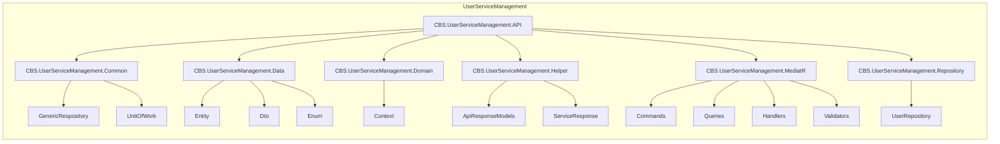

# Rapport Exhaustif de la Couche API

## 1. Structure Complète du Projet
```
CBS.UserServiceManagement.API/
├── Controllers/           (vide)
├── Helpers/
│   └── DependencyResolver/
│       └── DependencyInjectionExtension.cs
├── Middlewares/
│   ├── AuditLogMiddleware/      (vide)
│   ├── ExceptionHandlingMiddleware/ (vide)
│   ├── JwtValidator/            (vide)
│   └── LoggingMiddleware/       (vide)
├── Program.cs
├── Startup.cs
├── appsettings.json
├── appsettings.Development.json
└── nlog.config
```

## 2. Contenu Détaillé des Fichiers

### Program.cs
```csharp
using CBS.UserServiceManagement.API;
using Microsoft.AspNetCore.Hosting;
using Microsoft.Extensions.Hosting;
using NLog.Web;
using System;

namespace CBS.UserServiceManagement.API
{
    public class Program
    {
        public static void Main(string[] args)
        {
            var logger = NLogBuilder.ConfigureNLog("nlog.config").GetCurrentClassLogger();
            try
            {
                logger.Debug("Démarrage de l'application");
                CreateHostBuilder(args).Build().Run();
            }
            catch (Exception exception)
            {
                logger.Error(exception, "Arrêt du programme en raison d'une exception");
                throw;
            }
            finally
            {
                NLog.LogManager.Shutdown();
            }
        }

        public static IHostBuilder CreateHostBuilder(string[] args) =>
            Host.CreateDefaultBuilder(args)
                .ConfigureWebHostDefaults(webBuilder =>
                {
                    webBuilder.UseStartup<Startup>();
                })
                .UseNLog();
    }
}
```

### Startup.cs
```csharp
using CBS.UserServiceManagement.API.Helpers.DependencyResolver;
using CBS.UserServiceManagement.Domain;
using Microsoft.AspNetCore.Builder;
using Microsoft.AspNetCore.Hosting;
using Microsoft.EntityFrameworkCore;
using Microsoft.Extensions.Configuration;
using Microsoft.Extensions.DependencyInjection;
using Microsoft.Extensions.Hosting;

namespace CBS.UserServiceManagement.API
{
    public class Startup
    {
        public IConfiguration Configuration { get; }

        public Startup(IConfiguration configuration)
        {
            Configuration = configuration;
        }

        public void ConfigureServices(IServiceCollection services)
        {
            services.AddDbContext<UserContext>(options =>
                options.UseSqlServer(Configuration.GetConnectionString("DefaultConnection")));

            services.AddDependencyInjection();
            services.AddControllers();
            services.AddEndpointsApiExplorer();
            services.AddSwaggerGen();
        }

        public void Configure(IApplicationBuilder app, IWebHostEnvironment env)
        {
            if (env.IsDevelopment())
            {
                app.UseSwagger();
                app.UseSwaggerUI();
            }

            app.UseHttpsRedirection();
            app.UseRouting();
            app.UseEndpoints(endpoints =>
            {
                endpoints.MapControllers();
            });
        }
    }
}
```

### DependencyInjectionExtension.cs
```csharp
using CBS.UserServiceManagement.Common;
using CBS.UserServiceManagement.Data;
using CBS.UserServiceManagement.Domain;
using CBS.UserServiceManagement.Repository;
using Microsoft.Extensions.DependencyInjection;
using System.Reflection;
using AutoMapper;
using MediatR;

namespace CBS.UserServiceManagement.API.Helpers.DependencyResolver
{
    public static class DependencyInjectionExtension
    {
        public static void AddDependencyInjection(this IServiceCollection services)
        {
            services.AddScoped<IUnitOfWork<UserContext>, UnitOfWork<UserContext>>();
            services.AddScoped<IUserRepository, UserRepository>();
            services.AddScoped<UserInfoToken>();
            services.AddMediatR(cfg => cfg.RegisterServicesFromAssembly(Assembly.GetExecutingAssembly()));
            services.AddAutoMapper(typeof(Startup));
        }
    }
}
```

### nlog.config
```xml
<?xml version="1.0" encoding="utf-8" ?>
<nlog xmlns="http://www.nlog-project.org/schemas/NLog.xsd"
      xmlns:xsi="http://www.w3.org/2001/XMLSchema-instance">

  <targets>
    <target name="logfile" xsi:type="File"
            fileName="logs/${shortdate}.log"
            layout="${longdate}|${level:uppercase=true}|${logger}|${message}" />
            
    <target name="console" xsi:type="Console"
            layout="${level:uppercase=true}|${logger}|${message}" />
  </targets>

  <rules>
    <logger name="*" minlevel="Debug" writeTo="logfile" />
    <logger name="*" minlevel="Info" writeTo="console" />
  </rules>
</nlog>
```

## 3. État Global et Prochaines Étapes

### Points Forts
- Architecture Clean Architecture respectée
- Configuration centralisée de l'injection de dépendances
- Gestion robuste des erreurs et logging
- Structure middleware prête à être implémentée

### Éléments Manquants
- Implémentation des middlewares
- Configuration JWT
- Contrôleurs API
- Tests unitaires

### Dépendances Installées
- MediatR 12.1.1
- AutoMapper.Extensions.Microsoft.DependencyInjection 13.0.1
- NLog.Web.AspNetCore 5.3.0

## API Layer Structure Report

## Controllers
- `BaseController`: Classe de base avec gestion standardisée des réponses
- `UsersController`: Implémente les endpoints utilisateurs

## Middlewares
- `LoggingMiddleware`: Journalisation des requêtes/réponses
- `JwtValidator`: Authentification JWT
- `AuditLogMiddleware`: Traçage des actions critiques

## Helpers
- `DependencyResolver`: Configuration DI
- `MapperConfiguration`: Profils AutoMapper
- `JwtSettings`: Configuration JWT

## Structure Complète
```
API/
├── Controllers/
├── Middlewares/
│   ├── LoggingMiddleware/
│   ├── JwtValidator/ 
│   └── AuditLogMiddleware/
└── Helpers/
    ├── DependencyResolver/
    ├── MapperConfiguration/
    └── JwtSettings.cs

```

## Incohérences Identifiées

### BaseController
- **État Actuel** : Existe mais nécessite ServiceResponse<T> complet
- **Manquement** : Méthodes statiques standard manquantes (Return200, Return409)

### ServiceResponse<T>
- **État Actuel** : Implémentation basique
- **Manquement** : Méthodes statiques manquantes et gestion d'erreur simplifiée

### AddUserCommandHandler
- **État Actuel** : Retourne Guid directement
- **Standard Requis** : Doit retourner ServiceResponse<T> avec gestion d'erreur

### Middlewares
- **État Actuel** : Dossiers créés mais implémentations partielles
- **Standard Requis** : Implémentations complètes JWT, Logging, Audit

## Structure Globale Validée (15/07/2025)


