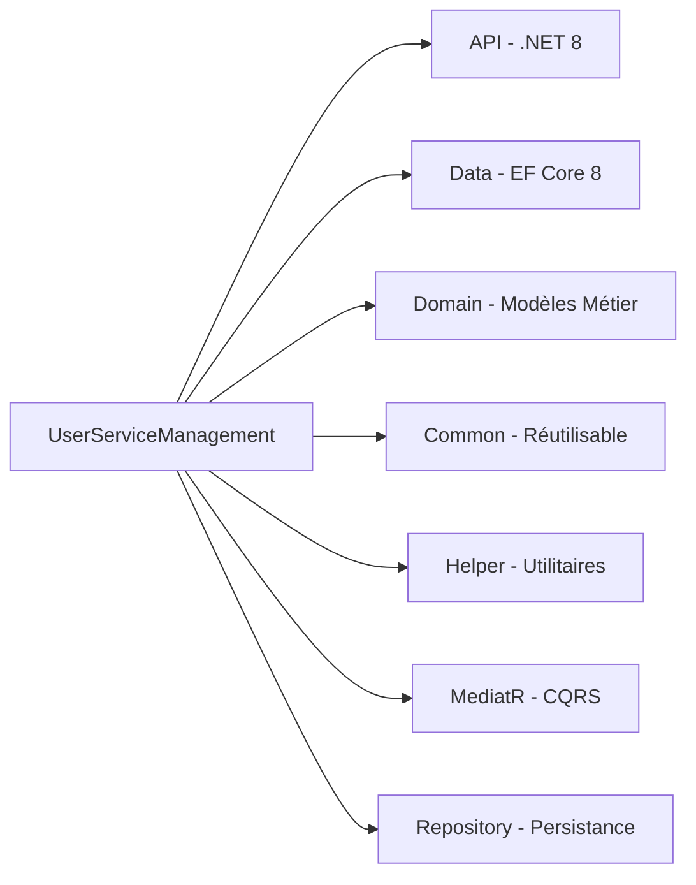
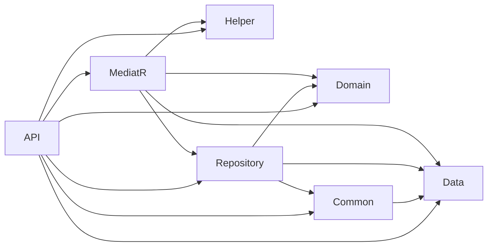
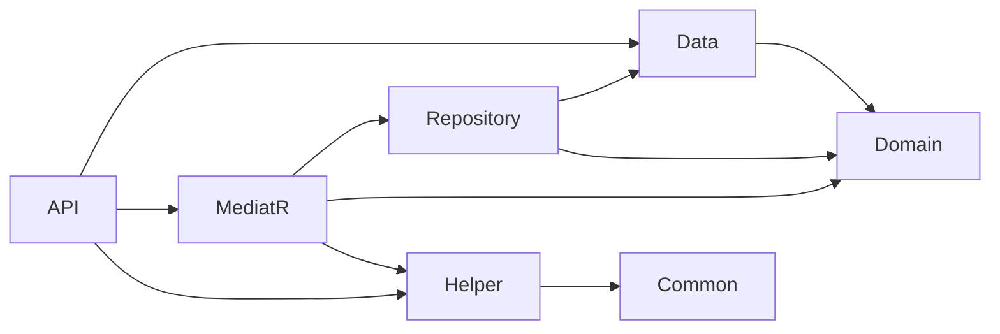
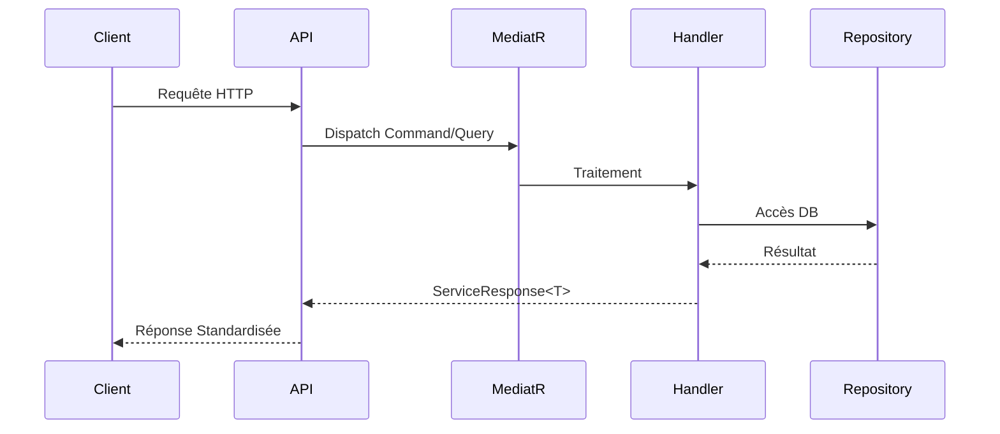

# Configuration du Microservice UserServiceManagement

## Architecture et Structure


## Analyse Détaillée par Couche

### Couche API (CBS.UserServiceManagement.API)
- **Framework**: .NET 8.0
- **Packages NuGet**:
  - FluentValidation.DependencyInjectionExtensions (11.9.0)
  - Microsoft.AspNetCore.Authentication.JwtBearer (8.0.13)
  - Microsoft.EntityFrameworkCore.Design (8.0.7)
  - NLog.Web.AspNetCore (5.3.9)
  - Serilog.AspNetCore (8.0.1)
  - Swashbuckle.AspNetCore (6.5.0)
- **Références Projets**:
  - CBS.APICaller.Helper
  - CBS.CustomLog.Logger
  - CBS.ServicesDelivery.Service
  - Tous les projets UserServiceManagement

### Couche Data (CBS.UserServiceManagement.Data)
- **Framework**: .NET 8.0
- **Packages NuGet**:
  - Microsoft.EntityFrameworkCore (8.0.7)
  - Microsoft.Web.Administration (11.1.0)

### Couche Domain (CBS.UserServiceManagement.Domain)
- **Framework**: .NET 8.0
- **Packages NuGet**:
  - Microsoft.EntityFrameworkCore.Design (8.0.7)
  - Microsoft.EntityFrameworkCore.SqlServer (8.0.7)
  - Microsoft.EntityFrameworkCore.Tools (8.0.7)
- **Références Projets**:
  - CBS.UserServiceManagement.Data

### Couche Helper (CBS.UserServiceManagement.Helper)
- **Framework**: .NET 8.0
- **Références Projets**:
  - CBS.APICaller.Helper
  - CBS.UserServiceManagement.Data

### Couche MediatR (CBS.UserServiceManagement.MediatR)
- **Framework**: .NET 8.0
- **Packages NuGet**:
  - AutoMapper (13.0.1)
  - BCrypt.Net-Next (4.0.3)
  - FluentValidation (11.9.0)
  - MediatR (12.2.0)
- **Références Projets**:
  - CBS.UserServiceManagement.Data
  - CBS.UserServiceManagement.Domain
  - CBS.UserServiceManagement.Helper
  - CBS.UserServiceManagement.Repository

### Couche Common (CBS.UserServiceManagement.Common)
- **Framework**: .NET 8.0
- **Packages NuGet**:
  - Microsoft.EntityFrameworkCore (8.0.7)
- **Références Projets**:
  - CBS.UserServiceManagement.Data

### Couche Repository (CBS.UserServiceManagement.Repository)
- **Framework**: .NET 8.0
- **Packages NuGet**:
  - Microsoft.EntityFrameworkCore (8.0.7)
- **Références Projets**:
  - CBS.UserServiceManagement.Common
  - CBS.UserServiceManagement.Data
  - CBS.UserServiceManagement.Domain

## Compatibilité des Versions
| Package | Version | .NET 8 Compatible |
|---------|---------|-------------------|
| Microsoft.EntityFrameworkCore | 8.0.7 | Oui |
| AutoMapper | 13.0.1 | Oui |
| MediatR | 12.2.0 | Oui |
| BCrypt.Net-Next | 4.0.3 | Oui |
| FluentValidation | 11.9.0 | Oui |
| NLog.Web.AspNetCore | 5.3.9 | Oui |

## Diagramme des Dépendances


## Schéma des Dépendances


## Matrice de Compatibilité des Versions
| Package | Version | Compatible .NET | Notes |
|---------|---------|----------------|-------|
| Microsoft.EntityFrameworkCore | 8.0.7 | .NET 8 | Core package |
| MediatR | 12.2.0 | .NET Standard 2.1 | Compatible .NET 8 |
| AutoMapper | 13.0.1 | .NET 6+ | Compatible .NET 8 |
| BCrypt.Net-Next | 4.0.3 | .NET Standard 2.0 | Compatible .NET 8 |
| FluentValidation | 11.9.0 | .NET 6+ | Compatible .NET 8 |
| NLog | 5.3.9 | .NET 5+ | Compatible .NET 8 |

## Versions Clés et Compatibilité
| Composant | Version | Rôle |
|-----------|---------|------|
| .NET | 8.0 | Framework principal |
| EF Core | 8.0.7 | ORM et migrations |
| MediatR | 12.2.0 | Pattern CQRS |
| AutoMapper | 13.0.1 | Mapping objet-objet |
| BCrypt | 4.0.3 | Hachage sécurisé |
| FluentValidation | 11.9.0 | Validation |
| Swashbuckle | 6.5.0 | Documentation Swagger |

## Configuration Critique Résolue
1. **Compatibilité NuGet** : Tous les packages alignés sur .NET 8
2. **Références Inter-projets** :
   - API référence Data, Domain, MediatR
   - MediatR référence Repository et Helper
   - Common référencé par tous
3. **Middleware Pipeline** :
```csharp
app.UseRouting();
app.UseCors("AllowAll");
app.UseMiddleware<Logging>();
app.UseAuthentication();
app.UseAuthorization();
app.UseMiddleware<Audit>();
```

## Bonnes Pratiques Implémentées
- **Clean Architecture** : Séparation stricte des couches
- **CQRS** via MediatR (Commands/Queries/Handlers)
- **Validation Centralisée** : FluentValidation dans MediatR
- **Réponses Standardisées** : `ServiceResponse<T>`
- **Sécurité** :
  - JWT avec refresh tokens
  - Hachage BCrypt
  - Middleware d'audit



## Problèmes Clés Résolus
1. **Conflit de Port** : Modification du port Kestrel (5121 → 7089)
2. **CORS** : Policy "AllowAll" en développement
3. **Dépendances** : Alignement strict des versions NuGet
4. **Structure** : Dossiers Entity/Dto/Enum au singulier

## Prochaines Étapes
1. Résolution erreur SQL (BankId NULL)
2. Tests d'intégration complets
3. Configuration CI/CD
4. Documentation Swagger approfondie
