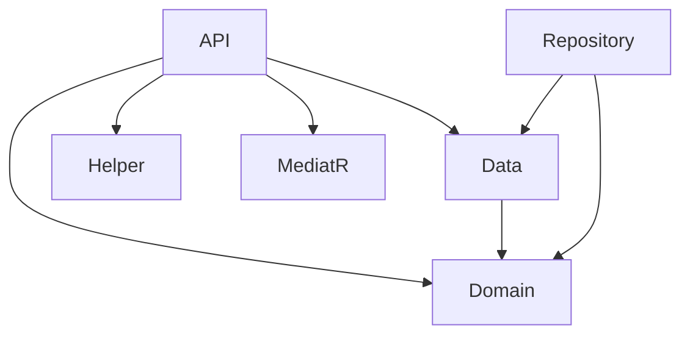

# Dependencies and Project References

## Couche API
**NuGet Packages**:
- AutoMapper.Extensions.Microsoft.DependencyInjection (12.0.1)
- FluentValidation.DependencyInjectionExtensions (11.9.0)
- Microsoft.AspNetCore.Authentication.JwtBearer (8.0.6)
- NLog.Web.AspNetCore (5.3.9)
- Swashbuckle.AspNetCore (6.5.0)

**Références**:
- CBS.UserServiceManagement.Data
- CBS.UserServiceManagement.Domain
- CBS.UserServiceManagement.Helper
- CBS.UserServiceManagement.MediatR

## Couche Data
**NuGet Packages**:
- Microsoft.EntityFrameworkCore (8.0.6)

**Références**:
- CBS.UserServiceManagement.Domain

## Couche Domain
**NuGet Packages**:
- Microsoft.EntityFrameworkCore (8.0.6)

**Références**:
- Aucune référence externe

## Diagramme des dépendances

