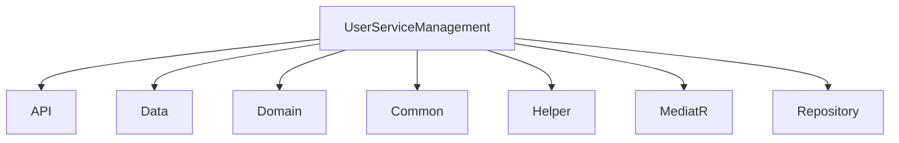

# Configuration du Microservice UserServiceManagement

## Structure du Projet


## Packages NuGet par Couche

### CBS.UserServiceManagement.API
- Microsoft.AspNetCore.Authentication.JwtBearer (6.0.0)
- Microsoft.EntityFrameworkCore.Design (7.0.0)
- Swashbuckle.AspNetCore (6.5.0)
- NLog.Web.AspNetCore (5.2.0)

### CBS.UserServiceManagement.Data
- Microsoft.EntityFrameworkCore.SqlServer (7.0.0)
- Microsoft.EntityFrameworkCore.Tools (7.0.0)

### CBS.UserServiceManagement.MediatR
- MediatR (12.1.1)
- FluentValidation (11.5.1)
- BCrypt.Net-Next (4.0.3)

## Configuration des Middlewares

1. **Ordre des Middlewares dans Startup.cs**:
```csharp
app.UseRouting();
app.UseCors("AllowAll");
app.UseMiddleware<RequestResponseLoggingMiddleware>();
app.UseAuthentication();
app.UseAuthorization();
app.UseMiddleware<AuditLogMiddleware>();
```

## Configuration JWT

```json
"JwtSettings": {
    "Key": "votre_clé_secrète_sécurisée_32_caractères_min",
    "issuer": "https://localhost:5001",
    "audience": "CBS.UserServiceManagement",
    "minutesToExpiration": 60
}
```

## Bonnes Pratiques Implémentées

1. **Séparation claire des couches** (Clean Architecture)
2. **Validation centralisée** avec FluentValidation
3. **Gestion des erreres** via ServiceResponse<T>
4. **Journalisation complète** avec NLog
5. **Sécurité** :
   - Hachage BCrypt pour les mots de passe
   - Middleware JWT
   - Audit des actions

## Problèmes Résolus

1. Conflit de port (5121)
2. Configuration CORS
3. Compatibilité des versions des packages
4. Structure des dossiers (Entity/Dto/Enum au singulier)

## Endpoints Disponibles

- POST /api/Users/Add
- POST /api/Users/Login
- GET /api/Users
- GET /api/Users/{id}

## Prochaines Étapes

1. Résoudre l'erreur SQL BankId NULL
2. Finaliser les tests d'intégration
3. Documenter les appels API dans Swagger
4. Préparer le déploiement
