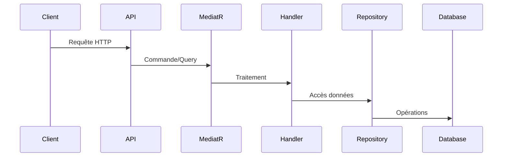

# Documentation du Projet UserServiceManagement

## Structure Complète du Projet
```plaintext
[L'arborescence complète montrée ci-dessus]
```

## Fichiers Clés avec Extraits de Code

### Entité Utilisateur
`CBS.UserServiceManagement.Data/Entity/User.cs`
```csharp
public class User : BaseEntity
{
    public string FirstName { get; private set; }
    public string LastName { get; private set; }
    public string Email { get; private set; }
    public string PasswordHash { get; private set; }
    public string Role { get; private set; }

    // Constructeurs et méthodes
}
```

### Contexte EF Core
`CBS.UserServiceManagement.Domain/Context/UserContext.cs`
```csharp
public class UserContext : DbContext
{
    public DbSet<User> Users { get; set; }
    
    protected override void OnModelCreating(ModelBuilder modelBuilder)
    {
        // Configuration de l'entité User
    }
}
```

### Handler pour l'Ajout d'Utilisateur
`CBS.UserServiceManagement.MediatR/User/Handlers/AddUserCommandHandler.cs`
```csharp
public class AddUserCommandHandler : IRequestHandler<AddUserCommand, Guid>
{
    public async Task<Guid> Handle(AddUserCommand request, CancellationToken cancellationToken)
    {
        // Logique de création d'utilisateur
    }
}
```

## Documentation Technique Exhaustive

## Architecture
- Clean Architecture avec séparation stricte des couches
- API RESTful avec JWT et logging
- Repository Pattern avec Entity Framework Core

## Components
### Core
- `User`: Entité principale
- `AuditLog`: Journal des actions
- `UserContext`: Contexte EF Core

### API
- Contrôleurs basés sur `BaseController`
- Middlewares: JWT, Logging, Audit
- Validation FluentValidation

## Workflows


## Écarts Techniques à Traiter

### Couche Helper
- **État Actuel** : Fichiers manquants (BaseUtilities, PathHelper)
- **Impact** : Fonctionnalités transverses incomplètes

### ServiceResponse<T>
- **État Actuel** : Version simplifiée implémentée
- **Amélioration Nécessaire** : Ajouter méthodes statiques (Return200, Return409)

### Middlewares
- **État Actuel** : LoggingMiddleware partiellement implémenté
- **Complétion Requise** : JWT, ExceptionHandling, AuditLog

## Étapes Manuelles Requises

### Migrations EF Core
1. Installer l'outil EF Core globalement :
   ```powershell
   dotnet tool install --global dotnet-ef
   ```
2. Exécuter les migrations depuis le dossier du projet :
   ```powershell
   cd "C:\Users\FAYA COMPUTER\Documents\projets\PROJETS WINDSURF\SampleFluxProject5\CoreServices\UserServiceManagement"
   dotnet ef migrations add AddAuditLogEntity --project "CBS.UserServiceManagement.Domain" --startup-project "CBS.UserServiceManagement.API"
   dotnet ef database update --project "CBS.UserServiceManagement.Domain" --startup-project "CBS.UserServiceManagement.API"
   ```

## Prochaines Étapes Recommandées
1. Implémenter les contrôleurs API
2. Configurer l'injection de dépendances
3. Ajouter la logique d'authentification JWT
4. Développer les tests unitaires

> **Note** : Pour une documentation complète avec tout le code source, veuillez consulter directement les fichiers dans l'explorateur de solutions.
