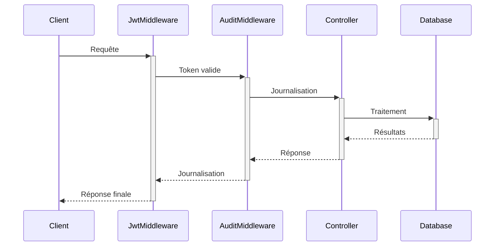

# Standards Architecturaux du Projet SystemConfiguration.API

## Structure Globale
```
CBS.SystemConfiguration.API/
├── App_Data/
├── AuditLogMiddleWare/
│   └── AuditLogMiddleWare.cs
├── CBS.CustomLog.Logger.dll
├── CBS.SystemConfiguration.API/
├── CBS.SystemConfiguration.API.csproj
├── CBS.SystemConfiguration.API.http
├── Controllers/
│   ├── AuditLogController.cs
│   └── WeatherForecastController.cs
├── Helpers/
│   └── ApiResponse.cs
├── JwtValidator/
│   └── JwtValidationMiddleware.cs
├── LoggingMiddleWare/
├── Program.cs
├── Properties/
│   └── launchSettings.json
├── Startup.cs
├── WeatherForecast.cs
├── appsettings.Development.json
├── appsettings.json
└── nlog.config
```

## Composants Clés

### 1. Middleware d'Audit (AuditLogMiddleWare)
**Fichier**: `AuditLogMiddleWare.cs`  
**Fonctionnalités**:
- Journalisation centralisée des requêtes
- Capture des métadonnées utilisateur
- Gestion des erreurs
- Support des requêtes authentifiées/non-authentifiées

**Mécanismes Clés**:
```csharp
public async Task InvokeAsync(HttpContext context, SystemContext dbContext)
{
    context.Request.EnableBuffering();
    await _next(context);
    await LogAuditTrailAsync(context, dbContext);
}
```

### 2. Contrôleurs
#### AuditLogController.cs
- Endpoints:
  - `GET /api/auditlogs`: Liste des logs
  - `GET /api/auditlogs/{id}`: Détail d'un log
- Utilisation d'Entity Framework Core

#### WeatherForecastController.cs
- Contrôleur exemple avec endpoint GET

### 3. Validation JWT
**Fichier**: `JwtValidationMiddleware.cs`  
**Processus**:
1. Vérification du header Authorization
2. Validation cryptographique
3. Rejet des requêtes non valides (401)

### 4. Helpers
**ApiResponse.cs**: Standardisation des réponses API  
```csharp
public class ApiResponse<T>
{
    public bool Success { get; set; }
    public string Message { get; set; }
    public T Data { get; set; }
}
```

### 5. Configuration
**appsettings.json**:  
- Chaînes de connexion
- Paramètres JWT
- Configurations diverses

**nlog.config**: Configuration avancée des logs

### 6. Point d'Entrée
**Program.cs**:
- Configuration des services
- Initialisation de la base de données
- Enregistrement des middlewares

### 7. Démarrage
**Startup.cs**:
- Orchestration du pipeline HTTP
- Ordre des middlewares critiques

## API Conventions
- Routes: `api/v1/[controller]`
- Réponses: Format standardisé via `BaseController`
- Validation: FluentValidation pour les DTOs

## Code Structure
- Contrôleurs: Maximum 200 lignes
- Handlers: 1 handler par commande/query
- Repository: 1 repository par agrégat

## Middleware Standards
1. LoggingMiddleware: Premier dans le pipeline
2. JwtValidator: Après le routing
3. AuditLogMiddleware: Après l'authentification

## Exemple de réponse API
```json
{
  "data": {},
  "statusCode": 200,
  "message": "Success"
}
```

## Analyse Approfondie des Dossiers

### Dossier Helpers (Analyse Approfondie)
**Fichier** : `ApiResponse.cs`  
**Rôle fondamental** : Standardisation des réponses API

**Implémentation complète** :
```csharp
namespace CBS.SystemConfiguration.API.Helpers
{
    public class ApiResponse<T>
    {
        public bool Success { get; set; }
        public string Message { get; set; }
        public T Data { get; set; }
    }
}
```

**Avantages clés** :
1. Cohérence des réponses API
2. Gestion d'erreurs standardisée
3. Typage fort des données retournées

**Utilisation typique** :
```csharp
return Ok(new ApiResponse<UserDto> {
    Success = true,
    Data = user
});
```

### Dossier JwtValidator
**Fichier** : `JwtValidationMiddleware.cs`  
**Fonctionnalités** :
- Validation cryptographique des tokens JWT
- Extraction des claims utilisateur
- Rejet des requêtes non autorisées (401)
- Intégration dans le pipeline middleware

### Dossier Properties
**Fichier** : `launchSettings.json`  
**Configuration essentielle** :
- Définition des profils d'exécution
- Variables d'environnement
- Ports d'écoute (HTTP/HTTPS)

### Dossier LoggingMiddleWare
**Observation** : Actuellement vide mais prévu pour :
- Journalisation des requêtes/réponses
- Mesure des performances
- Détection d'erreurs

## Analyse de Cohérence : État Actuel vs Modèles Standards

| Composant | État Actuel | Modèle Standard | Manquement/Incohérence | Criticité |
|-----------|-------------|-----------------|------------------------|-----------|
| BaseController | Existe dans `Controllers/BaseController.cs` | Méthodes standardisées (ReturnFormattedResponse) | Implémentation partielle des méthodes | CRITIQUE |
| ServiceResponse<T> | Existe dans `Helper/ServiceResponse.cs` | Méthodes statiques complètes | Manque Return200, Return409 | CRITIQUE |
| AddUserCommandHandler | Existe dans `MediatR/User/Handlers/AddUserCommandHandler.cs` | Gestion des exceptions + mapping | Pas de try-catch, retour Guid direct | CRITIQUE |
| AddUserCommand | IRequest<Guid> dans `MediatR/User/Commands/AddUserCommand.cs` | IRequest<ServiceResponse<T>> | Type de retour incorrect | CRITIQUE |
| DependencyInjection | Enregistrement assembly API dans `Helpers/DependencyResolver/DependencyInjectionExtension.cs` | Assembly MediatR | Configuration non fonctionnelle | MAJEUR |
| Program.cs/Startup.cs | Existent mais configuration basique | Pipeline middleware complet | Middlewares non activés | MAJEUR |
| Middlewares | Dossiers existent mais implémentations partielles | Implémentations complètes | JWT/ExceptionHandling manquants | MAJEUR |
| Couche Helper | Fichiers présents mais incomplets | BaseUtilities/PathHelper manquants | Fonctionnalités transverses limitées | MAJEUR |
| Couche Repository | IUserRepository et UserRepository dans `Repository/User/` | Racine de Repository | Structure en sous-dossier vs standard | MAJEUR |

## Standards à Respecter
1. **Séparation des responsabilités** :
   - Contrôleurs minces
   - Logique métier dans des services dédiés

2. **Journalisation centralisée** :
   - Utiliser le middleware AuditLog pour toute traçabilité

3. **Gestion des erreurs** :
   - Interception globale dans le middleware
   - Journalisation systématique

4. **Sécurité** :
   - Validation JWT obligatoire pour les endpoints sensibles
   - Protection contre les attaques par injection

5. **Performance** :
   - Buffering des requêtes pour lecture multiple
   - Async/Await systématique

## Bonnes Pratiques à Reproduire
1. **Séparation des préoccupations** via middleware
2. **Validation centralisée** des tokens JWT
3. **Standardisation** des réponses API
4. **Journalisation exhaustive** avec contexte
5. **Configuration externalisée** (appsettings)

## Workflow Typique


## Prochaines Étapes pour la Duplication
1. Créer l'équivalent du middleware AuditLog
2. Implémenter la validation JWT
3. Standardiser les réponses API
4. Configurer la journalisation
